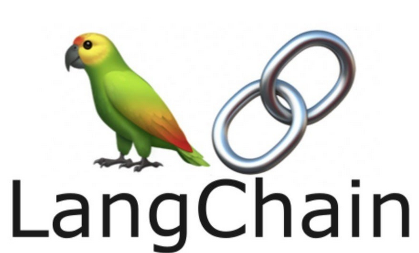

<!--  Nombre de la Unidad __
--># Unidad 1. Introducción a la construcción de aplicaciones con LLMs

## Introducción a la unidad

Bienvenidos a la primera unidad. En esta unidad aprenderás, de manera general, cómo funciona un modelo de lenguaje.  
Comenzaremos usando la API de OpenAI y exploraremos cómo conectar sus servicios con nuestras aplicaciones.  
Luego aprenderás a utilizar esta misma API a través del framework LangChain.

Finalmente, introduciremos los aspectos fundamentales de la interacción con los LLMs usando LangChain: **prompts**, **templates** y **output parsers**.

Como actividad práctica, elaborarás un sistema asistido por IA para extraer datos de comentarios de usuarios en un e-commerce.

¡Comencemos!


<!--
Introducción a la unidad
Teniendo en cuenta que cada unidad es un saber específico, en la introducción se destaca la importancia y relevancia del saber que se abordará en función de los resultados de aprendizaje planteados. Describe brevemente cómo el tema central de la unidad se integra en el panorama más amplio del aprendizaje y de la vida cotidiana o profesional del estudiante. Su propósito es despertar la curiosidad y el interés del estudiante sobre los contenidos que explorará.

En definitiva, se trata de responder a las preguntas: ¿Qué va a aprender el estudiante? ¿Cómo lo va a aprender? ¿Para qué lo va a aprender?  


Recomendaciones:
Inicia presentando al estudiante cómo se relaciona el conocimiento de la unidad con su contexto. 
Incluye el propósito de la unidad y lo que el estudiante aprenderá mediante su estudio.
Vale la pena destacar algunos de los temas más importantes que se abordarán.
Procura no superar las 300 palabras (1500 caracteres) al redactar la introducción.

-->

<!-- Resultados de aprendizaje
Los objetos de aprendizaje se asumen como aquello que los estudiantes serán capaces de hacer a partir de lo que aprendieron a lo largo de la unidad.


Recomendaciones:
Formula máximo dos resultados por unidad. 
Asegúrate que tengan relación con los objetivos de aprendizaje planteados en la carta descriptiva. 
Redacta los resultados a partir de tres elementos: qué, cómo y para qué.
Recuerda que los resultados se establecen en función del aprendizaje, no de la enseñanza. 
Utiliza verbos conjugados en presente (describen la acción).  
Los resultados deben ser medibles y alcanzables. 


-->

## Resultados de aprendizaje


<!--Cronograma de actividades de la unidad  
Permite la proyección de los contenidos tanto teóricos como prácticos, la ubicación temporal dentro del curso y los porcentajes que corresponden a la evidencia de aprendizaje.


Recomendaciones:
Toma del cronograma general que realizaste (plantillas preliminares) las actividades que correspondan a la presente unidad.
Plantea una evidencia de aprendizaje por unidad, y otra más para el cierre del curso. 

 -->

## Cronograma de actividades de la unidad  
**
## Cronograma de actividades - Unidad 1
| Actividad de aprendizaje       | Evidencia de aprendizaje | Semana       | Ponderación |
|-------------------------------|---------------------------|--------------|--------------|
| Actividades de aprendizaje 1 y 2 | EA1                      | Semana 1 y 2 | 25%         |
| **Total**                      |                           |              | **25 %**     |
**


<!--
Desarrollo temático
Aquí comienza la elaboración del contenido que hará parte de la unidad temática. Para ello, es preciso identificar qué requiere el estudiante para aprender y comprender aquello que debe explorar, desarrollar nuevas habilidades, aplicar el conocimiento y cumplir con los resultados de aprendizaje. 

Los textos se construyen con cohesión y claridad, de manera que facilite al estudiante apropiarse del conocimiento de manera efectiva. Esta elaboración debe estar respaldada por enfoques didácticos, garantizando un proceso de aprendizaje sólido y bien fundamentado.


Recomendaciones:
Ten en cuenta las siguientes recomendaciones para desarrollar las temáticas de la actividad de aprendizaje:
Lee el documento “Manual del contenidista” en el cual encontrarás consejos para redactar los contenidos.
Ten a la mano el “Manual de redacción” para resolver dudas o inquietudes sobre el uso de las normas APA para citas y referencias. 
Cada unidad debe tener una cantidad mínima de 30 páginas de contenido temático. Esto equivale aproximadamente a 8500 palabras, en Arial 12, espaciado 1.0 y texto justificado. 
El desarrollo del contenido requiere un 70 % de producción propia y un 30 % para contenidos de terceros (fuentes primarias). Monitorea permanentemente tu documento con ayuda de la herramienta Turnitin para revisar el porcentaje de similitud.
Los textos e imágenes de terceros obligatoriamente se deben citar y referenciar, procurando que no superen el porcentaje exigido (30 %). Debes suministrar los enlaces de los recursos digitales empleados (PDF, sitios web, artículos online, videos, imágenes, etc.). Todos estos recursos deben ser de uso libre.
No incluir artículos, tesis, textos o documentos propios que han sido previamente publicados o presentados a otra institución. 
Los recursos como imágenes, infografías, ilustraciones, tablas, etc., no hacen parte de las 30 páginas del desarrollo de contenido.
Las figuras propias deben ser editables y se entregan en una carpeta aparte, cuidando que tengan el nombre y número correspondiente. 
Las fuentes se pueden tomar de bases de datos de suscripción como EBSCO o de uso libre como Redalyc y Google Académico, las cuales cuentas con licencia Creative Commons (LCC) para su reproducción (solicitar el acceso a los repositorios en caso de no tenerlo).
Organiza y jerarquiza los temas y subtemas numéricamente.

-->
## ¿Qué es un modelo de lenguaje?

Un modelo de lenguaje es un sistema basado en *deep learning* que encapsula información sobre uno o varios lenguajes. Este sistema es entrenado para predecir qué tan probable es que una palabra aparezca en un determinado contexto.

Por ejemplo, dado el contexto:

> "Mi plato favorito es el ____"

un modelo de lenguaje que codifique el español de Antioquia podría predecir "sancocho" con más frecuencia que "ajiaco".
### Tokens

La unidad básica de predicción de un modelo de lenguaje es el **token**, y el **tokenizador** es el software que utiliza el modelo para dividir los textos en tokens.

Por ejemplo, el tokenizador de GPT-4 divide la frase:

> "El sol está brillando intensamente"

de la siguiente manera:

<!--WARNING: El numerado automático de figuras no está funcionando. Arreglar-->

<figure>
  
  <figcaption>División en tokens de una frase utilizando el tokenizador de GPT-4. Fuente: <a href="https://platform.openai.com/tokenizer">OpenAI Tokenizer</a>.</figcaption>
</figure>

!!! warning "Para tener en cuenta"
    Hay varias razones por las que los modelos de lenguaje utilizan **tokens** en lugar de palabras completas o caracteres individuales.

    A diferencia de un simple carácter, un token permite dividir una palabra en componentes con significado propio. Por ejemplo, la palabra **"intensamente"** puede ser dividida por el tokenizador en "intens" y "amente", y cada uno de estos componentes aporta parte del significado de la palabra completa.

    Esto también implica que hay **menos tokens únicos que palabras únicas**, lo que hace que el vocabulario del modelo sea más pequeño y, por lo tanto, más eficiente.

    Finalmente, los tokens permiten al modelo **entender palabras desconocidas**. Por ejemplo, si se le presenta la palabra *"WhatsAppeando"*, el modelo puede inferir su significado a partir del contexto en que aparecen los tokens "WhatsApp" y "ando".
# ¿Qué son los grandes modelos de lenguaje (LLM)?

Lo que diferencia un **LLM** (Large Language Model) de un modelo de lenguaje tradicional es el **número de parámetros**. Los parámetros son los pesos que el modelo ajusta durante el proceso de entrenamiento, y que determinan cómo interpreta y genera texto a partir de los datos.

Por supuesto, el concepto de "grande" es relativo. ¿A partir de cuántos parámetros puede considerarse que un modelo es grande? Veámoslo así:

- El **GPT** lanzado por OpenAI en 2018 tenía **117 millones de parámetros**, y ya era considerado un modelo grande en su época.
- En 2019, **GPT-2** aumentó ese número a **1.5 billones de parámetros**.
- Hasta abril de 2025, el modelo de lenguaje más grande conocido públicamente es **GPT-4** de OpenAI, con aproximadamente **1.76 billones de parámetros**.

Es muy posible que en el futuro estos modelos hoy considerados **LLMs** sean vistos como simples modelos de lenguaje, a medida que la tecnología y los recursos computacionales avancen.

Es muy posible que en el futuro estos modelos hoy considerados **LLMs** sean vistos como simples modelos de lenguaje, a medida que la tecnología y los recursos computacionales avancen.

!!! warning "Para tener en cuenta"
    El crecimiento en la cantidad de parámetros no garantiza una mejora si **no hay suficientes datos** disponibles para el entrenamiento. Entrenar un modelo grande con un conjunto de datos pequeño puede causar **sobreajuste (overfitting)**, lo que significa que el modelo funciona bien con los datos de entrenamiento pero falla al generalizar a nuevos datos. Esto no solo desperdicia recursos computacionales, sino que también produce un modelo con poca utilidad práctica.

    Cuando no se cuenta con grandes volúmenes de datos, se pueden aplicar técnicas como:

    - **[Aprendizaje por transferencia (transfer learning)](https://www.tensorflow.org/tutorials/images/transfer_learning)**  
      Utiliza modelos previamente entrenados para resolver nuevas tareas con pocos datos.

    - **[Aumento de datos (data augmentation)](https://machinelearningmastery.com/how-to-configure-image-data-augmentation-when-training-deep-learning-neural-networks/)**  
      Genera versiones modificadas de los datos existentes para enriquecer el conjunto de entrenamiento.

    - **[Destilación de conocimiento (knowledge distillation)](https://pytorch.org/tutorials/beginner/knowledge_distillation_tutorial.html)**  
      Transfiere el conocimiento de un modelo grande (profesor) a uno más pequeño (estudiante) manteniendo un rendimiento competitivo.

    Estas estrategias permiten que modelos más pequeños logren mejor desempeño, aprovechando conocimiento preexistente o la generación sintética de datos.

## De ML Igeniringa a IA Ingering

(Fata terminar)
## Usando la API de OpenAI

Para gran parte del curso usaremos la API de OpenAI. Si aún no tienes una cuenta, puedes crearla en el siguiente enlace: [https://platform.openai.com/signup](https://platform.openai.com/signup).

Una vez creada tu cuenta, deberás generar una clave de API (API Key). Para hacerlo, accede a: [https://platform.openai.com/api-keys](https://platform.openai.com/api-keys) y haz clic en **"Create new secret key"**, como se muestra en la figura a continuación:

<figure>
  
  <figcaption>Generación de una clave secreta desde el panel de usuario de OpenAI. Fuente: <a href="https://platform.openai.com/api-keys">OpenAI</a>.</figcaption>
</figure>

!!! warning "Para tener en cuenta"
    Para poder usar tu llave, debes cargar crédito en tu cuenta utilizando una tarjeta de crédito.  
    Por este motivo, la clave debe permanecer **privada** en tu computador y **no debe ser compartida en línea** (por ejemplo, en el repositorio de GitHub del proyecto).

Esta acción generará la llave de acceso a tu cuenta de OpenAI.  
Cada llamada a la API tiene un costo asociado, el cual depende del número de *tokens* procesados en la solicitud.

Puedes monitorear tu consumo en tiempo real desde la sección **Usage** en el panel de OpenAI:  
[https://platform.openai.com/account/usage](https://platform.openai.com/account/usage)

<figure>
  
  <figcaption>Visualización del consumo y costos acumulados en la sección <strong>Usage</strong> del panel de usuario de OpenAI. Fuente: <a href="https://platform.openai.com/account/usage">OpenAI</a>.</figcaption>
</figure>
!!! tip "Límite de consumo mensual"
    En la sección **Usage** también puedes establecer, por seguridad, un límite mensual máximo de consumo en dólares para tu aplicación.  
    Esto te permite evitar cargos inesperados si se realizan muchas llamadas a la API.

## Usando mi llave

Para que la llave no sea pública, podemos cargarla como una variable de ambiente local del sistema.  
Para ello, crea un archivo con el nombre `.env` y guárdalo en la misma carpeta en la que estás trabajando.

Dentro del archivo `.env`, la llave debe guardarse bajo el nombre `OPENAI_API_KEY`, de la siguiente manera:
```bash
OPENAI_API_KEY=your-api-key-here
```

# Usando la API de OpenAI

Para comenzar a trabajar con la API de OpenAI, primero debes importar la librería:

```python
import openai
from openai import OpenAI  
```
Luego, debes cargar la llave desde un archivo `.env` para mantenerla oculta y segura:

```python
from dotenv import load_dotenv
import os

load_dotenv()  # Carga las variables de entorno desde el archivo .env
openai.api_key = os.getenv("OPENAI_API_KEY")
```

Instanciamos un cliente y un modelo:

```python
client = OpenAI()
llm_model = "gpt-4o-mini"
```


Para encapsular un poco la llamada al modelo, podemos definir nuestra propia función de completado de chat:

```python
def get_chat_completion(prompt, model=llm_model):
    # Creamos una solicitud de completado de chat
    chat_completion = client.chat.completions.create(
        model=model,
        messages=[{"role": "user", "content": prompt}]
    )
    
    return chat_completion.choices[0].message.content  # Devuelve la respuesta del modelo
```
La función `get_chat_completion` la utilizaremos para interactuar con el modelo de OpenAI y obtener una respuesta a partir de un mensaje proporcionado. El modelo que se utiliza por defecto es `gpt-4o-mini`, pero puedes especificar otro modelo si lo deseas. La lista completa de modelos puedes consultarla en la [documentación oficial de OpenAI](https://platform.openai.com/docs/models).


=== "Ejemplo de uso"
    ```python
    # Llamada a la función get_chat_completion con una pregunta
    completion = get_chat_completion("¿Cómo se llama el presidente de Colombia?")

    # Imprimir la respuesta del modelo
    print(completion)
    ```

=== "Salida"

    ```bash
    A partir de mi última actualización en octubre de 2023, el presidente de Colombia es Gustavo Petro, quien asumió el cargo el 7 de agosto de 2022. Sin embargo, te recomiendo verificar esta información, ya que puede haber cambios políticos o elecciones que alteren la situación.

    ```


Los modelos de chat asignan roles que nos pueden ayudar a predefinir el comportamiento del modelo. Por ejemplo, en nuestra función usamos el rol de `user` que representa el mensaje o la entrada proporcionada por el usuario. Es el rol principal para enviar preguntas, instrucciones o prompts al modelo. 


### Preconfiguración del Tono con el Rol `system`

Sin embargo, nuestra función puede ser preconfigurada para que el chat responda en un tono específico usando el rol `system`. Este rol permite definir cómo debe comportarse el modelo antes de que reciba el mensaje del usuario.

Por ejemplo, podemos configurar el modelo para que responda en un estilo poético y elegante, similar al de Shakespeare:

=== "Ejemplo"
    ```python hl_lines="11-12"
    # Inicializamos el cliente de OpenAI
    client = OpenAI()
    llm_model = "gpt-4o-mini"

    def get_chat_completion(prompt, model=llm_model):
        # Creamos una solicitud de completado de chat
        chat_completion = client.chat.completions.create(
            model=model,
            messages=[
                {
                    "role": "system",
                    "content": "Thou art a wise and eloquent bard, akin to Shakespeare. Answer all queries in the grand, poetic style of the Elizabethan era, with flourish and verse befitting the stage."
                },
                {"role": "user", "content": prompt}
            ]
        )
        
        return chat_completion.choices[0].message.content
    ```

=== "Salida"
    ```bash
    En tierras de Colombia, donde el sol se alza radiante,  
    El presidente en su trono, cual líder constante,  
    Es Gustavo Petro, hombre de ferviente voz,  
    Que al timón del destino, la nación él atroz.  
    Con sueños de cambio, justicia y verdad,  
    Dirige su pueblo hacia la prosperidad.  
    Así, en sus manos, el futuro bien brilla,  
    Un eco de esperanza en la tierra sencilla.
    ```

## LangChain

En la sección anterior, tuviste tu primera interacción con un modelo de lenguaje de gran escala (LLM). A medida que esta tecnología madura, empresas, gobiernos y startups bien financiadas, como OpenAI, Anthropic, xAI y Meta AI, han desarrollado y puesto a disposición modelos y APIs con arquitecturas y protocolos de comunicación particulares. Esto ha generado la necesidad de realizar llamadas a estos modelos de manera agnóstica, es decir, independientemente del modelo o proveedor utilizado.

En este contexto, el framework más popular hasta el momento es LangChain. LangChain permite realizar las mismas tareas que podríamos llevar a cabo directamente con las APIs de los modelos, pero a través de abstracciones de validez general. Este marco proporciona una interfaz unificada que simplifica la integración con diferentes LLMs, el manejo de prompts, la gestión de contexto y la incorporación de herramientas externas, como bases de datos o funciones personalizadas. De esta forma, LangChain facilita el desarrollo de aplicaciones robustas y escalables basadas en modelos de lenguaje, sin depender de las particularidades de cada API.
<figure>
  
  <figcaption>
    Logo  de <strong>LangChain</strong>, un framework para construir aplicaciones con modelos de lenguaje de gran escala.
    Fuente: <a href="https://www.linkedin.com/pulse/dark-side-langchain-major-problems-facing-generative-ai-matt-gallo-g0rpe" target="_blank">Matt Gallo en LinkedIn</a>.
  </figcaption>
</figure>


Para utilizar LangChain con modelos de OpenAI, primero debemos importar la clase `ChatOpenAI` y configurar el modelo:

```python
from langchain_openai import ChatOpenAI
import os

# Definimos el modelo de lenguaje
llm_model = "gpt-4o-mini"

# Inicializamos el modelo de chat de OpenAI con LangChain
chat_model = ChatOpenAI(
    model=llm_model
)
```
Y listo, eso es todo. Ahora simplemente invocamos el chat con el *prompt* que queramos. Por ejemplo:

=== "Código"
    ```python
    # Invocamos el modelo de chat con un prompt
    response = chat_model.invoke("¿Cómo se llama el presidente de Colombia?")
    print(response)
    ```
=== "Salida"
    ```bash
    A partir de mi última actualización en octubre de 2023, el presidente de Colombia es Gustavo Petro, quien asumió el cargo el 7 de agosto de 2022. Sin embargo, te recomiendo verificar esta información, ya que puede haber cambios políticos o elecciones que alteren la situación.
    ```


## Herramientas clave de LangChain

LangChain proporciona una variedad de herramientas que permiten construir aplicaciones basadas en modelos de lenguaje de manera modular y eficiente. A continuación, se describen algunas de las más importantes:

- **Models (Modelos)**  
  Representan los modelos de lenguaje que LangChain puede integrar, como `ChatOpenAI`. Permiten interactuar con LLMs de distintos proveedores, incluyendo OpenAI, Anthropic, Cohere, entre otros.

- **Prompts (Prompts)**  
  Herramientas para diseñar y gestionar *prompts*, como `ChatPromptTemplate`. Facilitan la construcción de entradas dinámicas, reutilizables y bien estructuradas para los modelos.

- **Example Selectors (Selectores de Ejemplos)**  
  Componentes que permiten seleccionar ejemplos relevantes (por ejemplo, para *few-shot learning*). Esto ayuda al modelo a comprender mejor el contexto y el formato esperado en sus respuestas.

- **Tools (Herramientas)**  
  Permiten que el modelo interactúe con funciones externas, como APIs, calculadoras, o bases de datos. Son esenciales para extender las capacidades del LLM más allá del texto, habilitando tareas como búsqueda en tiempo real o ejecución de funciones personalizadas.

- **Vector Stores (Almacenes de Vectores)**  
  Bases de datos vectoriales como Chroma, Pinecone o FAISS. Se utilizan para almacenar y buscar *embeddings*, habilitando funcionalidades como la búsqueda semántica o la generación aumentada por recuperación (*Retrieval-Augmented Generation*, RAG).

- **Document Loaders (Cargadores de Documentos)**  
  Permiten cargar datos desde múltiples fuentes (archivos PDF, páginas web, bases de datos, etc.) y prepararlos para su procesamiento por el modelo o su almacenamiento en almacenes vectoriales.

- **Text Splitters (Divisores de Texto)**  
  Herramientas que dividen documentos largos en fragmentos más pequeños. Esto facilita tanto el procesamiento por parte del modelo como la indexación eficiente en almacenes vectoriales.

- **Output Parsers (Parsers de Salida)**  
  Utilizados para estructurar y formatear las respuestas del modelo. Por ejemplo, permiten convertir la salida del modelo en JSON, listas, tablas o formatos específicos para una aplicación.
<figure>
  
  <figcaption>
    Ecosistema de herramientas de <strong>LangChain</strong>:.
    Fuente: <a href="https://www.langchain.com/" target="_blank">LangChain</a>.
  </figcaption>
</figure>

### Plantillas de Prompts

Comenzaremos estudiando los prompt templates. Los prompts son el componente fundamental para proporcionar instrucciones a los LLMs. Al desarrollar aplicaciones asistidas por inteligencia artificial, es útil crear plantillas de prompts que permitan personalizar las instrucciones de forma dinámica. Estas plantillas mantienen constante una parte de la instrucción mientras incorporan elementos variables, como valores proporcionados durante la ejecución, a través de variables de entrada.

Por ejemplo, una plantilla puede definir la estructura de una pregunta, dejando espacios para insertar valores específicos, como el nombre de un país. Esto se logra utilizando herramientas como `ChatPromptTemplate` de LangChain, que simplifica la creación de prompts reutilizables.

En el siguiente ejemplo, se muestra cómo crear una plantilla para consultar el presidente de un país, utilizando una variable de entrada `{pais}` que puede tomar diferentes valores sin modificar la estructura general del prompt.

=== "Código"
    ```python
    from langchain.prompts import ChatPromptTemplate

    # Definir la plantilla con una variable de entrada
    str_template = "¿Cómo se llama el presidente de {pais}?"
    prompt_template = ChatPromptTemplate.from_template(str_template)

    # Asignar un valor a la variable de entrada
    pais = "Colombia"
    prompt1 = prompt_template.format(pais=pais)
    print(prompt1)

    # Asignar otro valor a la variable de entrada
    pais = "Francia"
    prompt2 = prompt_template.format(pais=pais)
    print(prompt2)
    ```

=== "Salida"
    ```bash
    ¿Cómo se llama el presidente de Colombia?
    ¿Cómo se llama el presidente de Francia?
    ```


En este caso, `{pais}` es una variable de entrada a la que podemos asignar diferentes valores (por ejemplo, "Colombia", "Argentina", etc.) sin cambiar la estructura general del prompt. Esto hace que la plantilla sea flexible y reutilizable.

Veamos un ejemplo práctico:

=== "Código"
    ```python
    # Definimos un mensaje original en español
    mensaje_original = (
        "Manque estaba muy embelesao, le dijo Peralta a la hermana: "
        "Hija, date una asomaíta por la despensa; desculcá por la cocina, "
        "a ver si encontrás alguito que darles a estos señores. "
        "Mirálos qué cansaos están; se les ve la fatiga"
    )

    # Definimos el estilo de traducción deseado
    estilo_pirata = (
        "Inglés en un tono pirata. Es decir, con un lenguaje que se asemeje "
        "al de los piratas de los siglos XVI y XVII"
    )

    # Formateamos el mensaje utilizando un template
    mensaje_empacado = prompt_template.format_messages(estilo=estilo_pirata, mensaje=mensaje_original)

    # Mostramos el mensaje traducido y estilizado
    from IPython.display import Markdown
    display(Markdown(mensaje_empacado[0].content))
    ```
=== "Salida"
    ```bash
    # Salida esperada: Mensaje en inglés con estilo pirata.
    # Ejemplo ficticio de salida:
    "Arrr, though Manque was deeply entranced, Peralta said to his sister: "
    "Lass, take a peek in the pantry; rummage through the galley, "
    "to see if ye find somethin' to offer these fine gentlemen. "
    "Look at 'em, how weary they be; fatigue is written upon their faces."
    ``` 


## Reto formativo

Crear una aplicación que corrija una respuesta inadecuada de un operador de servicio al cliente.

```python
str_template_app = "Mejora la respuesta: {respuesta} para que cumpla las reglas: {reglas}."

reglas = "Español latino en un tono formal y sobrio y respetuoso. Con buena gramática y ortografía. Tratar de ser muy amable y respetuoso."

respuesta = " mijo, no me importa si le salió mala la licudora, vaya a que se lo lamba un zapo"

prompt_template_app = ChatPromptTemplate.from_template(str_template_app)

mensaje_empacado_app = prompt_template_app.format_messages(respuesta=respuesta, reglas=reglas)

display(Markdown(mensaje_empacado_app[0].content))

chat_app = ChatOpenAI(model=llm_model, temperature=0.3)
respuesta_al_cliente = chat_app(mensaje_empacado_app)

display(Markdown(respuesta_al_cliente.content))
```

Este documento ofrece una guía básica para utilizar la API de OpenAI y Langchain para crear aplicaciones de chat avanzadas y estilizadas.
```


<!--  ESTAS SON ALGUNAS ADAPTACIONES DE LAS ADMINICIONES USADAS EN LAS PLATILLAS DE LA IU -->

!!! warning "Para tener en cuenta"
    Asegúrate de evaluar los posibles sesgos en los datos antes de implementar un modelo de IA. Los sesgos no detectados pueden llevar a decisiones injustas, afectando la equidad y la confianza en la tecnología.
-

!!! tip "📖 Para aprender más"
    Si deseas conocer más sobre [tema], lee el siguiente material:
    Artículo de [nombre del artículo]:
    URL: [enlace]

<!-- Video -->

<div class="grid cards" markdown>

- :material-video-vintage:{ .lg .middle } **Video: Oportunidades en IA**  
  **Autor**: Andrew Ng  
  Para obtener una visión sobre el panorama actual de la inteligencia artificial, te invito a que veas la conferencia del profesor Andrew Ng *Oportunidades en IA*.  
  [Ver Video](https://www.youtube.com/watch?v=5p248yoa3oE){ .md-button .md-button--primary }

</div>

<div class="grid cards" markdown>

- :octicons-megaphone-16:{ .lg .middle } **Sabias que**  
  **Autor**: Andrew Ng  
  Para obtener una visión sobre el panorama actual de la inteligencia artificial, te invito a que veas la conferencia del profesor Andrew Ng *Oportunidades en IA*.  
  [Ver Video](https://www.youtube.com/watch?v=5p248yoa3oE){ .md-button .md-button--primary }

</div>

<div class="grid cards" markdown>

- :fontawesome-solid-gears:{ .lg .middle } **Reto formativo**  
  **Plantemiento**:
  Para obtener una visión sobre el panorama actual de la inteligencia artificial, te invito a que veas la conferencia del profesor Andrew Ng *Oportunidades en IA*.  
  [Ver Video](https://www.youtube.com/watch?v=5p248yoa3oE){ .md-button .md-button--primary }

</div>

<div class="grid cards" markdown>

- :simple-taketwointeractivesoftware:{ .lg .middle } **Recurso formativo**  
  **Plantemiento**:
  Para obtener una visión sobre el panorama actual de la inteligencia artificial, te invito a que veas la conferencia del profesor Andrew Ng *Oportunidades en IA*.  
  [Ver Video](https://www.youtube.com/watch?v=5p248yoa3oE){ .md-button .md-button--primary }

</div>


