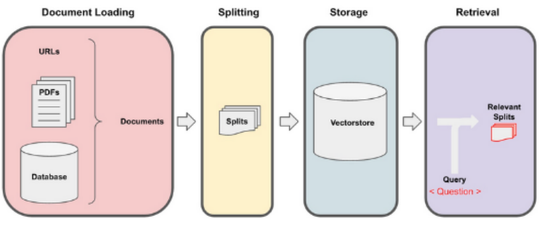
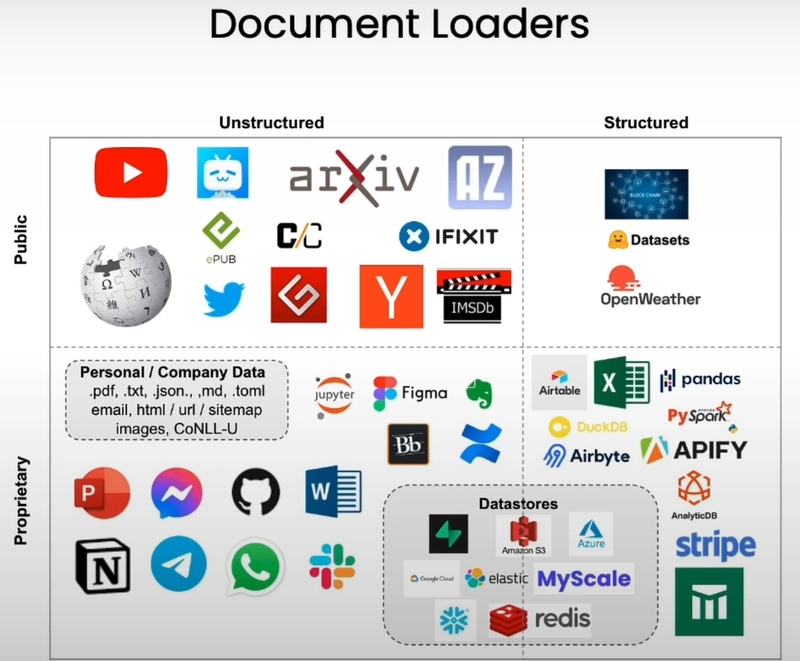
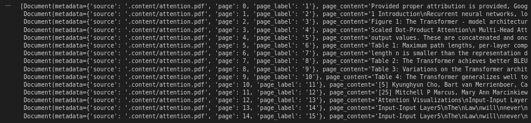
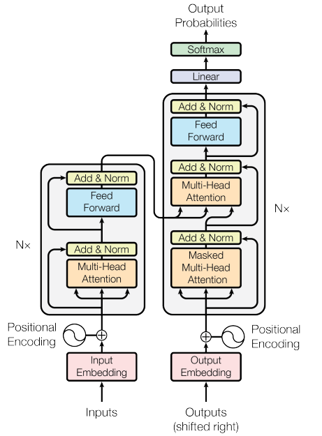

<!--  Nombre de la Unidad __
-->

# Unidad 3: Proyecto Integtrador. Construcción y depliegue de un sisitema RAG
<!--
Introducción a la unidad
Teniendo en cuenta que cada unidad es un saber específico, en la introducción se destaca la importancia y relevancia del saber que se abordará en función de los resultados de aprendizaje planteados. Describe brevemente cómo el tema central de la unidad se integra en el panorama más amplio del aprendizaje y de la vida cotidiana o profesional del estudiante. Su propósito es despertar la curiosidad y el interés del estudiante sobre los contenidos que explorará.

En definitiva, se trata de responder a las preguntas: ¿Qué va a aprender el estudiante? ¿Cómo lo va a aprender? ¿Para qué lo va a aprender?  


Recomendaciones:
Inicia presentando al estudiante cómo se relaciona el conocimiento de la unidad con su contexto. 
Incluye el propósito de la unidad y lo que el estudiante aprenderá mediante su estudio.
Vale la pena destacar algunos de los temas más importantes que se abordarán.
Procura no superar las 300 palabras (1500 caracteres) al redactar la introducción.
-->

## Introducción a la unidad


Bienvenodos a la última unidad de nuestro curso sobre aplicacionea asistidas por LLMs. En esta unidad aperndereos sobre dument loaders y deplegaremos una aplicación Rag funcional para conversar con alrchivos en pdf.

<!-- Resultados de aprendizaje
Los objetos de aprendizaje se asumen como aquello que los estudiantes serán capaces de hacer a partir de lo que aprendieron a lo largo de la unidad.


Recomendaciones:
Formula máximo dos resultados por unidad. 
Asegúrate que tengan relación con los objetivos de aprendizaje planteados en la carta descriptiva. 
Redacta los resultados a partir de tres elementos: qué, cómo y para qué.
Recuerda que los resultados se establecen en función del aprendizaje, no de la enseñanza. 
Utiliza verbos conjugados en presente (describen la acción).  
Los resultados deben ser medibles y alcanzables. 

-->

## Cronograma de actividades - Unidad 1
| Actividad de aprendizaje       | Evidencia de aprendizaje | Semana       | Ponderación |
|--------------------------------|---------------------------|--------------|--------------|
| Reto Formativo 1 y 2           | EA1:  Templates y Output Parsers | Semana 1, 2 y 3 | 25%         |
| **Total**                      |                           |              | **25 %**     |


<!--
Desarrollo temático
Aquí comienza la elaboración del contenido que hará parte de la unidad temática. Para ello, es preciso identificar qué requiere el estudiante para aprender y comprender aquello que debe explorar, desarrollar nuevas habilidades, aplicar el conocimiento y cumplir con los resultados de aprendizaje. 

Los textos se construyen con cohesión y claridad, de manera que facilite al estudiante apropiarse del conocimiento de manera efectiva. Esta elaboración debe estar respaldada por enfoques didácticos, garantizando un proceso de aprendizaje sólido y bien fundamentado.


Recomendaciones:
Ten en cuenta las siguientes recomendaciones para desarrollar las temáticas de la actividad de aprendizaje:
Lee el documento “Manual del contenidista” en el cual encontrarás consejos para redactar los contenidos.
Ten a la mano el “Manual de redacción” para resolver dudas o inquietudes sobre el uso de las normas APA para citas y referencias. 
Cada unidad debe tener una cantidad mínima de 30 páginas de contenido temático. Esto equivale aproximadamente a 8500 palabras, en Arial 12, espaciado 1.0 y texto justificado. 
El desarrollo del contenido requiere un 70 % de producción propia y un 30 % para contenidos de terceros (fuentes primarias). Monitorea permanentemente tu documento con ayuda de la herramienta Turnitin para revisar el porcentaje de similitud.
Los textos e imágenes de terceros obligatoriamente se deben citar y referenciar, procurando que no superen el porcentaje exigido (30 %). Debes suministrar los enlaces de los recursos digitales empleados (PDF, sitios web, artículos online, videos, imágenes, etc.). Todos estos recursos deben ser de uso libre.
No incluir artículos, tesis, textos o documentos propios que han sido previamente publicados o presentados a otra institución. 
Los recursos como imágenes, infografías, ilustraciones, tablas, etc., no hacen parte de las 30 páginas del desarrollo de contenido.
Las figuras propias deben ser editables y se entregan en una carpeta aparte, cuidando que tengan el nombre y número correspondiente. 
Las fuentes se pueden tomar de bases de datos de suscripción como EBSCO o de uso libre como Redalyc y Google Académico, las cuales cuentas con licencia Creative Commons (LCC) para su reproducción (solicitar el acceso a los repositorios en caso de no tenerlo).
Organiza y jerarquiza los temas y subtemas numéricamente.

-->


<!-- Your content for this section goes here -->

## Retival Aumented generation (RAG)

El desempeño de un modelo de lenguaje en un tópico particular depende de cuánto haya visto datos sobre este tópico en su proceso de entrenamiento. Si un tema no aparece mucho en internet, el modelo tiene una capacidad limitada para responder preguntas sobre este, mientras que si este tema es muy bien difundido, el desempeño del modelo en este tipo de temas será mucho mejor. Por otro lado, existe información que el modelo nunca vio, por ejemplo, los contratos de compraventa de una empresa que se dedica a la venta de casas, los decretos y ordenanzas que los gobiernos emitieron después de la última actualización del modelo, etc.

En una RAG, un LLM recupera documentos contextuales a partir de una base de datos externa como parte de su ejecución. Esto es útil si queremos hacer preguntas sobre documentos específicos. La figura muestra el esquema general de una aplicación RAG.
{ width=" " }
*Esquema de flujo de una aplicación RAG. Fuente: [LangChain Documentation](https://python.langchain.com/docs/concepts/rag/).*

El sistema de Recuperación (Retrieval) es el encargado de devolver los documentos relevantes para que el LMM (Modelo de Lenguaje de Máquina) elabore la respuesta a partir de una solicitud. Este sistema está compuesto por tres subsistemas:

- **Cargador de Documentos (Document Loader):** Carga documentos desde diversas fuentes, como archivos locales, sitios web, bases de datos, etc.
- **Divisor de Texto (Text Splitter):** Divide los documentos en fragmentos manejables para su procesamiento.
- **Almacén Vectorial (Vector Store):** Almacena representaciones vectoriales de los documentos para una recuperación eficiente.

La Figura ilustra cómo estos subsistemas interactúan en el pipeline de RAG:

{ #fig-retrieval-subsystems }
*Fuente: [Curso "Chat with Your Data" de DeepLearning.AI](https://www.deeplearning.ai/short-courses/chat-with-your-data/).*<!-- Nota para edición: Por favor construit ua imagen propia-->
## Cargadores de Documentos

Comenzaremos experimentando con algunas de las herramientas de carga de documentos disponibles. Es importante resaltar que existe una gran variedad, como lo ilustra la imagen:


*Fuente: [Curso "Chat with Your Data" de DeepLearning.AI](https://www.deeplearning.ai/short-courses/chat-with-your-data/).*

En esencia, un Cargador de Documentos en LangChain es un componente que obtiene datos de una fuente especificada y los transforma en un formato estandarizado que LangChain puede entender y con el que puede trabajar. Este formato estandarizado es típicamente un objeto Documento.

Una vez que un cargador de documentos ingiere datos, usualmente los transforma en uno o más objetos Documento. Piensa en esto como nuestro contenedor estandarizado para datos de texto. Un objeto Documento en LangChain consiste principalmente en dos atributos clave:

- **page_content:** Contiene el contenido de texto real del documento o un fragmento de él.

- **metadata (diccionario):** Es un diccionario que contiene información adicional sobre el contenido. ¡Esto es muy importante! Los metadatos pueden incluir cosas como:
    - La fuente del documento (por ejemplo, nombre del archivo, URL, ID de base de datos)
    - Fecha de creación, autor
    - Número de página (para PDFs)
    - Títulos de secciones específicas
    - Cualquier otra información contextual que consideres relevante.

El uso efectivo de metadatos puede mejorar significativamente la capacidad de tu aplicación para filtrar, buscar y entender el contexto de la información.

## Categorías y Ejemplos de Cargadores de Documentos

LangChain ofrece un vasto ecosistema de cargadores de documentos, ¡actualmente más de 80, y la comunidad sigue añadiendo más! Exploremos algunos:

### Cargadores Basados en Archivos:
Estos cargadores leen datos directamente de archivos. Vemos algunos:

#### Documentos PDF

##### `PyPDFLoader` 

Una de las herramientas diponibles para carga de documentos en PDF es  `PyPDFLoader`. Este cargador extrae texto y metadatos de archivos PDF basados en texto, es decir, no es apropiado si el PDF es un escaneo de una imagen. Supongamos que nuestro texto lo tenemos en la carpeta de contenidos `./content`. En este caso, cargaremos el archivo [attention.pdf](../assets/documents/attention.pdf) de la siguiente manera:

```python
from langchain.document_loaders import PyPDFLoader

output_path = "./content/"
file_path = output_path + 'attention.pdf'
loader = PyPDFLoader(file_path)  # Instancia del cargador.
pages = loader.load()
```
La línea `pages = loader.load()` ejecuta el método `.load()`, que lee el PDF y devuelve una lista de objetos `Document`. Cada `Document` representa una página del PDF, con `page_content` (el texto extraído) y `metadata` (información como la fuente y el número de página).

`pages` será una lista de objetos `Document`.  
Cada `Document` tendrá:
- `page_content`: El texto extraído de una página del PDF.
- `metadata`: Un diccionario con información como `{"source": "./content/attention.pdf", "page": n}` (donde `n` es el número de página, comenzando desde 0).

Podemos inspeccionar el contenido cargado:

=== "Código"
    ```python
    pages
    ```
=== "Salida"
    ```bash
    [<Document page_content="Texto de la página 1" metadata={"source": "./content/attention.pdf", "page": 0}>,
    <Document page_content="Texto de la página 2" metadata={"source": "./content/attention.pdf", "page": 1}>,
    ...]
    ```
    
Así, por ejemplo, podremos acceder al contenido cargado de la primera página haciendo:

=== "Código"
    ```python
    first_page = pages[0]
    print("Contenido de la primera página:")
    print(first_page.page_content)
    ```

=== "Salida"
    ```bash
    Contenido de la primera página:
    Provided proper attribution is provided, Google hereby grants permission to
    reproduce the tables and figures in this paper solely for use in journalistic or
    scholarly works.
    Attention Is All You Need
    Ashish Vaswani∗
    Google Brain
    avaswani@google.com
    Noam Shazeer∗
    Google Brain
    noam@google.com
    Niki Parmar∗
    Google Research
    nikip@google.com
    Jakob Uszkoreit∗
    Google Research
    usz@google.com
    Llion Jones∗
    Google Research
    llion@google.com
    Aidan N. Gomez∗ †
    University of Toronto
    aidan@cs.toronto.edu
    Łukasz Kaiser∗
    Google Brain
    ...
    †Work performed while at Google Brain.
    ‡Work performed while at Google Research.
    31st Conference on Neural Information Processing Systems (NIPS 2017), Long Beach, CA, USA.
    arXiv:1706.03762v7  [cs.CL]  2 Aug 2023
    ```
!!! tip "📖 Para aprender más"
    Puedes conocer más cargadores de documentos PDF consultando la documentación de LangChain en:
    [How to: load PDF files.](https://python.langchain.com/docs/integrations/document_loaders/#pdfs)

##### Unstructured

El cargador de documentos Unstructured se utiliza para cargar archivos de muchos tipos. Actualmente, Unstructured admite la carga de archivos de texto, presentaciones de PowerPoint, HTML, PDFs, imágenes y más.

El paquete Unstructured de Unstructured.IO extrae texto limpio de documentos fuente como PDFs y documentos de Word.

!!! warning "Para tener en cuenta"
    La API de Unstructured requiere claves de API para realizar solicitudes para opciones más avanzadas. Puedes solicitar una clave de API [aquí](https://unstructured.io/enterprise) y comenzar a usarla.

Para ilustrar su uso, usaremos el mismo archivo PDF del ejemplo anterior:

```python
from unstructured.partition.pdf import partition_pdf

output_path = ".content/"
file_path = output_path + 'attention.pdf'
```

En su forma más básica, sin ninguna configuración adicional, podemos cargar el documento como:

```python
# Carga y procesa el pdf con la configuración básica
chunks = partition_pdf(filename=file_path)
```

=== "Salida"
    ```bash
    [<unstructured.documents.elements.Text at 0x702efe8e0a60>,
    <unstructured.documents.elements.NarrativeText at 0x702efe8e0ac0>,
    ...
    ```

Visualicemos los documentos extraídos:

```python
# Muestra los elementos extraídos
for chunk in chunks:
    print(chunk)
```

=== "Salida"
    ```bash
    3 2 0 2
    g u A 2
    ] L C . s c [
    ...
    ```

!!! tip "📖 Para aprender más"
    Puedes explorar las diferentes funcionalidades de carga en el siguiente enlace:
    [Documentación de Unstructured](https://docs.unstructured.io/open-source/core-functionality/chunking)

Para un mayor control sobre la forma en que podemos extraer los diferentes tipos de datos del PDF, podemos configurar la función `partition_pdf` de la siguiente manera:

```python
chunks = partition_pdf(
    filename=file_path,
    infer_table_structure=True,            # Extraer tablas
    strategy="hi_res",                     # Necesario para inferir tablas

    extract_image_block_types=["Image"],   # Agregar 'Table' para extraer imágenes de tablas
    # image_output_dir_path=output_path,   # Si es None, las imágenes y tablas se guardarán en base64

    extract_image_block_to_payload=True,   # Si es True, extraerá base64 para uso en API

    chunking_strategy="by_title",          # O 'basic'
    max_characters=10000,                  # Por defecto es 500
    combine_text_under_n_chars=2000,       # Por defecto es 0
    new_after_n_chars=6000,

    # extract_images_in_pdf=True,          # Obsoleto
)
```
Aquí, la función `partition_pdf` procesa el archivo PDF extrayendo no solo texto, sino también imágenes y tablas. La función divide el PDF en partes manejables, conocidas como "chunks", y permite ajustar la forma en que se extraen los diferentes tipos de contenido. En particular, se infiere la estructura de las tablas, se extraen bloques de imágenes, y se define cómo dividir el contenido en chunks basándose en títulos y límites de caracteres. Las imágenes extraídas se codifican en base64 para facilitar su transmisión o almacenamiento.

!!! tip "📖 Para aprender más"
    El formato base64 es un método de codificación que convierte datos binarios en texto ASCII, permitiendo que los datos sean fácilmente transmitidos a través de medios que solo soportan texto. Puedes aprender más sobre el formato base64 en la [documentación de Wikipedia](https://es.wikipedia.org/wiki/Base64).
Verifiquemos el contenido extraído:

```python
chunks
```

=== "Salida"
    ```bash
    [<unstructured.documents.elements.CompositeElement at 0x702efeb07670>,
     <unstructured.documents.elements.CompositeElement at 0x702e358f2be0>,
     <unstructured.documents.elements.CompositeElement at 0x702efeb07be0>,
     <unstructured.documents.elements.CompositeElement at 0x702efeb07f40>,
     ...
    ```

Con esta configuración, obtenemos dos tipos de elementos:

```python
set([str(type(el)) for el in chunks])
```

=== "Salida"
    ```bash
    {"<class 'unstructured.documents.elements.CompositeElement'>",
     "<class 'unstructured.documents.elements.Table'>"}
    ```

Un `CompositeElement` generalmente contiene múltiples elementos secundarios de varios tipos, como texto, imágenes o tablas. Esto permite que la biblioteca gestione secciones de un documento compuestas por diferentes tipos de contenido como una sola entidad.

En el procesamiento de documentos, es común encontrar secciones que incluyen una mezcla de texto, imágenes y otros elementos que lógicamente son parecidos. 
Un `CompositeElement` puede representar dichas secciones. Cada objeto `CompositeElement` tiene un atributo `metadata`, que es una instancia de la clase `ElementMetadata`. Este atributo contiene información adicional sobre el chunk, como números de página, detalles del archivo o datos estructurales. Por ejemplo:

```python
chunks[3].metadata.orig_elements
```

=== "Salida"
    ```bash
    [<unstructured.documents.elements.Title at 0x702e35e7ed60>,
     <unstructured.documents.elements.NarrativeText at 0x702e35e7edf0>,
     <unstructured.documents.elements.Footer at 0x702e0cedd940>,
     <unstructured.documents.elements.Image at 0x702e0ceddd00>,
     <unstructured.documents.elements.Image at 0x702e0ceddac0>,
     <unstructured.documents.elements.NarrativeText at 0x702e0cedde50>,
     <unstructured.documents.elements.NarrativeText at 0x702e0d38a730>,
     <unstructured.documents.elements.Title at 0x702e0d38aca0>,
     <unstructured.documents.elements.NarrativeText at 0x702e0d38adc0>,
     <unstructured.documents.elements.NarrativeText at 0x702e0d16a7c0>,
     <unstructured.documents.elements.Formula at 0x702e0d16a0a0>,
     <unstructured.documents.elements.NarrativeText at 0x702e0d16a610>,
     <unstructured.documents.elements.NarrativeText at 0x702e0d433d30>]
    ```

Aquí, `orig_elements` es un campo específico dentro de la metadata que almacena una referencia a los elementos originales, no divididos, a partir de los cuales se creó el chunk. Generalmente, es una lista de objetos `Element` que fueron combinados o procesados para formar el chunk actual. En este chunk particular, tenemos los siguientes elementos:

- Título
- Texto narrativo
- Pie de página
- Imagen
- Fórmula

Separemos las imágenes en el chunk:

```python
elements = chunks[3].metadata.orig_elements

chunks_images = [el for el in elements if "Image" in str(type(el))]
chunks_images
```

=== "Salida"
```bash
[<unstructured.documents.elements.Image at 0x702e0ceddd00>,
 <unstructured.documents.elements.Image at 0x702e0ceddac0>]
```

La siguiente función extraerá todas las imágenes del documento en una lista:


```python
# Extraer las imágenes de los CompositeElements

def get_images_base64(chunks):
    images_b64 = []
    for chunk in chunks:
        if "CompositeElement" in str(type(chunk)):  # Filtramos los CompositeElements
            chunks_els = chunk.metadata.orig_elements
            for el in chunks_els:
                if "Image" in str(type(el)):
                    images_b64.append(el.metadata.image_base64)
    return images_b64
```
Y podemos verificar la extracción visualizándola:

```python
import base64
from IPython.display import Image, display

def display_base64_image(base64_code):
    image_data = base64.b64decode(base64_code)
    display(Image(data=image_data))

display_base64_image(images[0])
```

=== "Salida"
    


### Web Based

Veamos ahora un ejemplo corto de carga de un documento web:

```python
from langchain.document_loaders import WebBaseLoader

loader = WebBaseLoader("https://concepto.de/reino-fungi/")
docs = loader.load()
print(docs[0].page_content[:500])
```

=== "Salida"
```bash
Reino Fungi - Concepto, tipos, características y ejemplos

...

Arte
Conocimiento
C
```

Este tipo de cargadores dejan como espacios en blanco los objetos que no son texto, como imágenes o tablas. Por lo tanto, requeriremos conectar otras herramientas que nos permitan hacer un pos-procesamiento adecuado.
Una característica de `WebBaseLoader` es que permite cargar varias URLs a la vez. Vamos a cargar contenido de dos páginas relacionadas:

```python
# Lista de URLs a cargar
urls = [
    "https://es.wikipedia.org/wiki/Inteligencia_artificial",
    "https://es.wikipedia.org/wiki/Aprendizaje_autom%C3%A1tico"
]

# Cargamos múltiples páginas
multi_loader = WebBaseLoader(urls)
multi_documents = multi_loader.load()

# Mostramos el número de documentos cargados y un extracto de cada uno
print(f"Se cargaron {len(multi_documents)} documentos.")
for i, doc in enumerate(multi_documents):
    print(f"Documento {i + 1} (primeros 200 caracteres):")
    print(doc.page_content[:200])
```

=== "Salida"
```bash
Se cargaron 2 documentos.
Documento 1 (primeros 200 caracteres):

Inteligencia artificial - Wikipedia, la enciclopedia libre

...

El algoritmo aprende observando el mundo que le rodea. Su información de entrada es la retroalimentación que obtiene del mundo exterior como respuesta a sus acciones. Por lo tanto, el sistema aprende a base de ensayo-error.

El aprendizaje por refuerzo es el más general entre las tres categorías. En vez de que un instructor indique al agente qué hacer, el agente inteligente debe aprender cómo se comporta el entorno mediante recompensas (refuerzos) o castigos, derivados del éxito o del fracaso respectivamente. El objetivo principal es aprender la función de valor que le ayude al agente inteligente a maximizar la señal de recompensa y así optimizar sus políticas de modo a comprender el comportamiento del entorno y a tomar buenas decisiones para el logro de sus objetivos formales.

Los principales algoritmos de aprendizaje por refuerzo se desarrollan dentro de los métodos de resolución de problemas de decisión finitos de Markov, que incorporan las ecuaciones de Bellman y las funciones de valor. Los tres métodos principales son: la programación dinámica, los métodos de Monte Carlo y el aprendizaje de diferencias temporales.

Entre las implementaciones desarrolladas está AlphaGo, un programa de IA desarrollado por Google DeepMind para jugar el juego de mesa Go. En marzo de 2016 AlphaGo le ganó una partida al jugador profesional Lee Se-Dol que tiene la categoría noveno dan y 18 títulos mundiales. Entre los algoritmos que utiliza se encuentra el árbol de búsqueda Monte Carlo, también utiliza aprendizaje profundo con redes neuronales. Puede ver lo ocurrido en el documental de Netflix “Alp
```
#### YouTube

La API `YouTubeTranscriptApi` es una herramienta útil para extraer transcripciones de videos de YouTube. Esta API permite obtener los subtítulos de un video en diferentes idiomas, facilitando el análisis de contenido de video de manera programática. A continuación, ilustraremos su uso utilizando el video de YouTube sobre  [retropropagación ](https://www.youtube.com/watch?v=kbGu60QBx2o).

```python
from youtube_transcript_api import YouTubeTranscriptApi

# Extraemos el ID del video desde la URL
video_id = "kbGu60QBx2o"  # ID de https://www.youtube.com/watch?v=kbGu60QBx2o (Backpropagation: Data Science Concepts)

try:
    transcript = YouTubeTranscriptApi.get_transcript(video_id, languages=['es', 'en'])
    print("Primeros 500 caracteres del transcrito manual:")
    print(" ".join([entry['text'] for entry in transcript])[:500])
except Exception as e:
    print(f"Error al obtener el transcrito manualmente: {str(e)}")
```

=== "Salida"
```bash
[Music] hey everyone in this video we're going to do a followup to our initial video on neural networks and this video is going to be on back propagation now I'm making this video on back propagation mostly because it's a really difficult concept to understand at least it was for me I read through multiple blog posts and watch videos and everyone seems to have their own kind of way of understanding and explaining it and it was difficult for me to match up all those understandings into what this 
```
## Text Splitters

Una vez hemos cargado el o los documentos sobre los cuales queremos realizar RAG (Recuperación de Información Asistida por Generación), debemos separarlos en fragmentos sobre los cuales crearemos nuestra base de datos de embeddings, es decir, una base de datos vectorial (ver [Figura 2](#fig-retrieval-subsystems)). La herramienta que nos permite hacer esto son los llamados **Text Splitters**.
